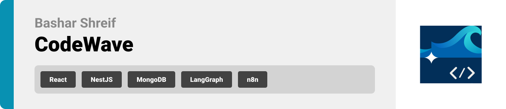

  
<!-- project overview -->

> **CodeWave** is an AI-powered VS Code extension.
> It analyzes your codebase, extracts insights, and generates a README file instantly.

> The Problem  
> Big codebases are messy. Documentation is missing, patterns are hidden, and onboarding takes too long.

> ✅ The Solution  
> **CodeWave** scans your project. It highlights structure, tools, and tests, then creates clear insights and a ready-to-use README.

  

<!-- System Design -->

## ER Diagram

## System Architecture

## N8N Automation Workflow

### Readme Generator

  

<!-- Project Highlights -->

## CodeWave Key Features

- **One Command, Full README**
  Generate a complete, project-specific README with a single command. Stay up to date without manually writing documentation.

- **Architecture Insights**
  Uncover the structure of your codebase. See how services, layers, and components connect at a glance.

- **CI/CD Awareness**
  Detect workflows and pipelines automatically. Understand how your project is built and deployed.

- **Configuration Map
  Summarize bundlers, CSS tools, environment files, and build configs. No more hunting through folders.**

- **Testing Overview**
  List test frameworks, coverage, and distribution. Quickly check the health of your testing strategy.\*

- **Docs Discovery**
  Find all README and docs files in your repo. Know what’s documented and where gaps exist.

- **Stacks Breakdown**
  See stacks usage across the project. Spot polyglot areas or dominant stacks instantly.

- **Codebase Stats**
  Count files, extensions, and sizes. Get a snapshot of your repo’s scale and distribution.

  

  

<!-- Demo -->

### Landing Screen

| Landing Screen                            |
| ----------------------------------------- |
|  |

### From Docs Website Screens

| About screen                        | Installation screen                      |
| ----------------------------------- | ---------------------------------------- |
|  |  |

<!-- Development & Testing -->

### Services, Validation, and Testing

<table align="center">
  <tr>
    <td align="center" valign="middle">
      
    </td>
    <td align="center" valign="middle">
      
    </td>
    <td align="center" valign="middle">
      
    </td>
  </tr>
</table>

<!-- AI Workflow -->

## 🧠 AI Workflow -> DAG Agent System

 
CodeWave's AI runs on one deterministic graph and one agents:  
Graph composes a no-AI Readme file depending on static code analysis, and an agent that uses static code analysis with codebase embeddings to create a fullfilled Readme file

---

### Graph: Static Readme Generation

| Graph Workflow                       |
| ------------------------------------ |
|  |

This graph works in the background, making sure to use tools for static code analysis to generate a Readme file with insights.

**How it works:**

- **Triggers:**
  - User hits generate no-AI Readme command from VS Code command palette.
- **Steps:**
  1. Graph starts with nodes to ingest the codebase and parse it to make it ready for using tools to analyze
  2. Uses more than 10 tools to analyze the parsed codebase and adds insights to the state of the graph
  3. Builds context from tools summaries
  4. Composes a no-AI Readme based in the saved outline
  5. Saves everything to the database

**Output:** A no-AI Readme file that has data about the codebase from static code analysis.

---

### Agent: AI Powered Readme Generation

| AI Agent Workflow                    |
| ------------------------------------ |
|  |

This is the agent you talk to directly your personal conversation assistant.

**How it works:**

- **Trigger:** Webhook from NestJS with projectId and snapshotId
- **Steps:**
  1. Validates payload and rate-limits. Sanitizes paths and blocks unsafe inputs
  2. Collects tool outputs: files/stats, architecture, CI/CD, configs, tests, docs, languages
  3. Retrieves codebase embeddings for the snapshot from the vector store
  4. Plans README sections from a template + repo signals
  5. For each section, builds RAG context (tools + embeddings) and drafts content
  6. Cites sources where applicable and attaches section metadata
  7. Joins sections, generates TOC, normalizes headings and anchors
  8. Validates links and asset paths. Fixes or flags broken refs
  9. Runs style/quality pass. Enforces length, lint rules, and consistency
  10. Saves artifact (README.md) to object storage and records metadata in MongoDB
  11. Updates analyses/insights/artifacts status and metrics (latency, tokens)
  12. Returns artifact URL and section map to NestJS. Supports per-section regenerate

**Output:** A complete README.md with section breakdown, references, and stored metadata for traceability and re-runs.

---

### Key Technical Features

- **Code Embeddings & Vector Search** – Chunked files and docs with cosine similarity via Chroma. Works with OpenAI, Nomic, or Ollama embeddings
- **Smart Snapshot Triggers** – Commit/webhook/command triggers with debounce and rate limits. Skips unchanged snapshots
- **Context Continuity (RAG)** – Each README section pulls from tools + embeddings. Diff-aware updates keep docs consistent across versions
- **Polyglot + Stack Detection** – Detects languages, frameworks, CI, and config. Unified model across monorepos and subprojects

---

### Why It Matters

Together, CodeWave acts as your **codebase brain**:

- Faster onboarding through instant context
- Architecture, stacks, and risks made visible
- Instant answers inside VS Code
- No drift: docs align with each snapshot
- Smarter over time via embeddings and history

---

  

<!-- Deployment -->

### Swagger API Documentation

<a href="https://bashar-shreif.github.io/codewave/#/">Access the full API documentation here</a>

The Swagger UI provides an **interactive playground** for developers:

- Browse the API catalog with per-endpoint docs.
- Review auth, required fields, and request/response schemas.
- Run try-it-now calls in the browser and see live results.
- Cut integration time and standardize API usage across the project.

| GET Architecture API            | GET Security Summary API         | Schemas Docs                       |
| ------------------------------- | -------------------------------- | ---------------------------------- |
|  |  |  |

  
