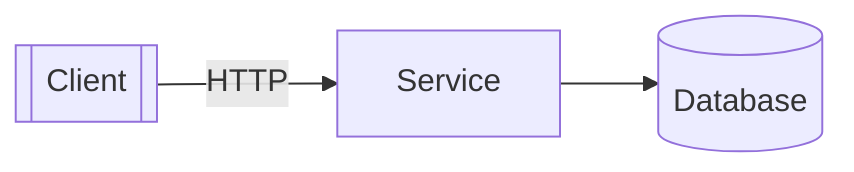
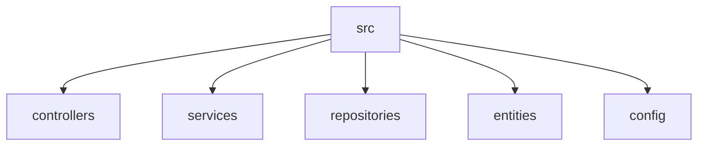

# Project
## Table of Contents

- [Overview](#overview)
- [Tech Stack](#tech-stack)
- [Diagrams](#diagrams)
- [Getting Started](#getting-started)
- [Configuration](#configuration)
- [Testing](#testing)
- [CI](#ci)
- [Documentation](#documentation)
- [Security](#security)

# Overview
Primary languages: json, php, javascript.

# Tech Stack
Languages: json 59%, php 21%, javascript 10%, css 10%

# Diagrams


Suggested structure diagram (replace with your own):



# Getting Started
```bash
npm ci
# add your start command
```

# Configuration
Bundler: Vite. CSS tooling: PostCSS, TailwindCSS.

# Testing
Testing with PHPUnit.

# CI
CI providers: GitHub Actions. Workflows: .github/workflows/ci-cd.yml.

# Documentation
Root README at `README.md`. Covered topics: usage, api.

# Security
Risk score 100/100. Env files present. Sensitive key/cert files detected. CORS wildcard configured in 1 file(s). Debug mode enabled in 4 file(s).

