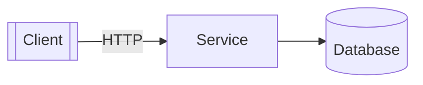
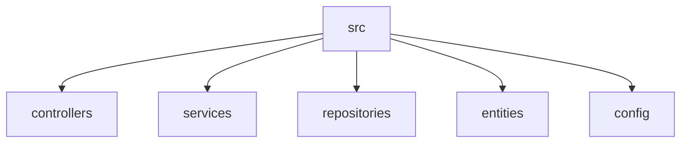

# Project
## Table of Contents

- [Overview](#overview)
- [Tech Stack](#tech-stack)
- [Diagrams](#diagrams)
- [Getting Started](#getting-started)
- [Documentation](#documentation)
- [Security](#security)

# Overview
Primary languages: json.

# Tech Stack
Languages: json 100%

# Diagrams


Suggested structure diagram (replace with your own):



# Getting Started
```bash
npm ci
# add your start command
```

# Documentation
Root README at `README.md`.

# Security
Risk score 0/100.

